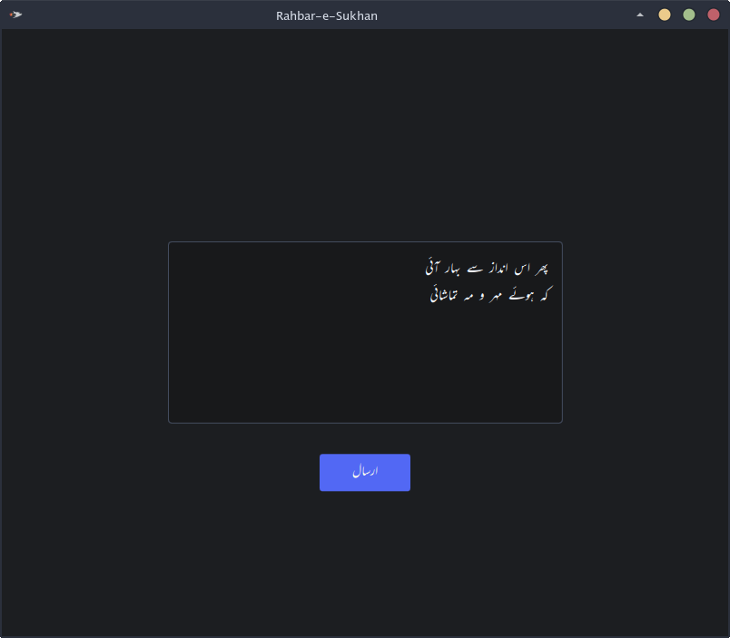
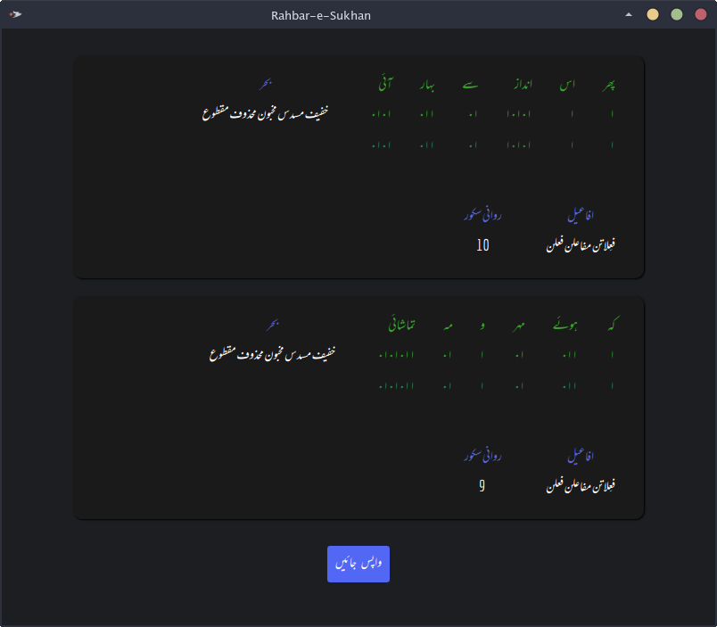
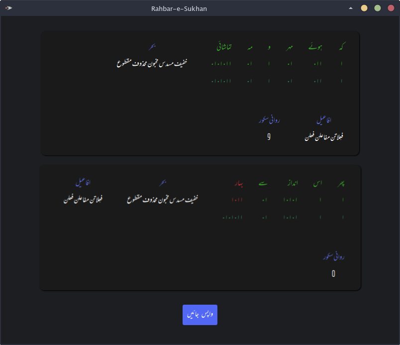

# Rahbar-e-Sukhan (The Novice Poet's Aide)

Cross-platform multithreaded scansion automaton for Urdu Poetry.

It can correctly identify the metre of a series of couplets given as input and provide apt  suggestions if an anomaly is detected in the rythm.

It features a snappy and modern user interface in a compact and intricately written package. 

## Showcase

## Built With

* [C++][https://isocpp.org/]
* [Qt Quick][https://doc.qt.io/qt-5/qtquick-index.html]
* [Intel Tbb][https://github.com/oneapi-src/oneTBB]